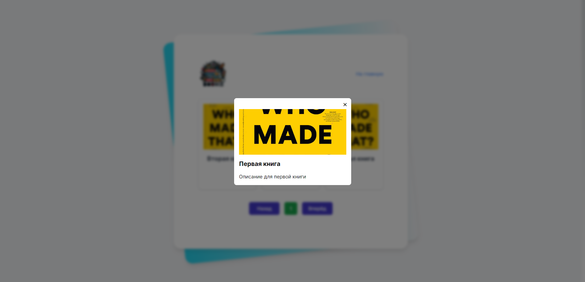

# Library App

## Описание
Library App - это приложение для управления библиотекой, которое позволяет пользователям просматривать и добавлять книги из каталога

## Функциональность
- Просмотр списка книг
- Добавление новых книг
- Пагинация на стороне сервера

## Технологии
- Frontend: Next js, React, Tailwind, Typescript
- Backend: Python, FastAPI
- База данных: MongoDB

## Установка
1. Клонирование репозитория:
    ```sh
    git clone https://github.com/Rus7Iv/library-app.git
    ```

2. Запуск сервера (localhost:8000 - сервер, localhost:27017 - база данных mongo)
    ```sh
    cd backend
    python -m venv venv
    venv\Scripts\activate
    pip install -r requirements.txt
    uvicorn app.main:app --reload
    ```

    Swagger: http://localhost:8000/api/docs

3. Запуск клиенской части (localhost:3000)
    ```sh
    cd frontend
    npm install
    npm run dev
    ```

## Пример работы




